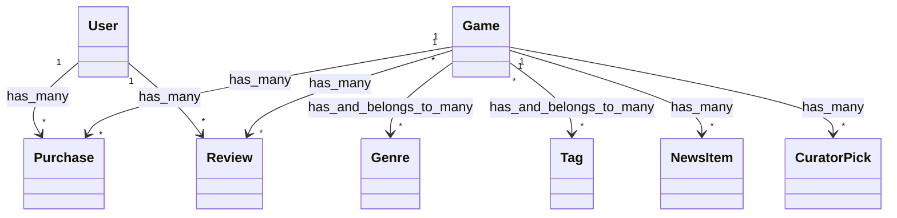

# JX-Team 校园主题游戏商店系统 - 答辩常见问题及解答 (Q&A)

这份文档整理了在项目答辩/评审中，老师可能针对**前端**、**后端**、**系统架构**、**数据流程**以及**AI协同开发**提出的常见问题及推荐解答。供小组成员在答辩前准备和复习使用。

---

## 目录
1. [系统架构与选型问题](#一系统架构与选型问题)
2. [后端与数据库设计问题](#二后端与数据库设计问题)
3. [前端与状态管理问题](#三前端与状态管理问题)
4. [核心业务逻辑与特色功能问题](#四核心业务逻辑与特色功能问题)
5. [数据采集、部署与测试问题](#五数据采集部署与测试问题)
6. [AI 协作与工具应用问题](#六ai-协作与工具应用问题)

---

## 一、系统架构与选型问题

### Q1: 为什么选择 Ruby on Rails 5.2 加上 React 的前后端分离架构，而不是直接用 Rails 默认的模版渲染（SSR）？
* **推荐解答**：
  1. **现代 Web 体验（SPA）**：游戏商店类应用（如 Steam）包含大量的动态交互、局部数据刷新（如购物车增删、愿望单切换、语言切换等）。如果采用传统的 Rails 模板渲染，每次跳转页面都要重新加载整个 HTML 页面，体验不够流畅。使用 React 构建单页应用（SPA）可以提供接近原生应用的流畅用户体验。
  2. **前后端职责分离**：Rails 作为纯 API 服务端，专注于数据处理、业务逻辑校验和安全保障；React 作为前端专注于视图呈现和局部交互状态管理。这种分离提高了代码的模块化和复用性，也更符合目前企业主流的开发模式。
  3. **高效开发**：后端开发成员可以通过 Rails 的快速开发特性（如强大的 Scaffolding、Active Record ORM）快速产出接口，前端开发成员可以利用 React 丰富的组件生态并行开发，互不阻塞，通过标准的 JSON API 规范进行联调。

### Q2: 为什么选择 PostgreSQL 作为数据库，而不是更常见的 MySQL？
* **推荐解答**：
  1. **复杂数据类型的支持**：我们的游戏商店系统需要支持多标签（Tags）、多分类（Genres）以及一些半结构化的元数据（例如游戏的系统配置要求、多国语言文案等）。PostgreSQL 对 JSONB 等半结构化数据类型的原生支持非常成熟，利于以后扩展复杂属性。
  2. **并发与事务控制**：对于游戏的“购买（Purchase）”业务，需要严格的事务保证（ACID）。PostgreSQL 在处理复杂事务、行级锁以及高并发读写方面表现非常稳定。
  3. **开发生态契合**：Rails 官方对 PostgreSQL 的支持极为友好，它是 Rails 在生产环境中最常推荐的数据库，能够完美利用 Rails 的 schema 迁移特性。

### Q3: 为什么前端使用 Webpack 5 负责构建，没有用现代的 Vite 或 Turbopack？
* **推荐解答**：
  1. **兼容性**：项目使用的 Rails 5.2 是一个经典的、极其稳定的 Rails 版本。在当时的历史上下文和现存遗留生态中，Webpack 与 Rails 的 Webpacker 整合最为紧密。
  2. **稳定性**：Webpack 5 插件生态极其成熟，配置好以后打包 React 17 和 SCSS 非常稳定，不会因为现代构建工具（如 Vite 的 ESM 机制）导致在旧版 Rails 资源管线中出现路径解析或热更新失效的问题。
  3. **交接简单**：为了让团队中零基础的同学也能够快速上手并本地运行，Webpack 的命令配置已经封装到了 `package.json`（`npm run build` 和 `npm run webpack`），对使用者屏蔽了复杂的底层打包细节，开箱即用。

---

## 二、后端与数据库设计问题

### Q1: 能介绍一下你们的数据库表（Model）是如何设计的吗？它们之间有什么关系？
* **推荐解答**：
  我们设计了 8 个核心模型，主要关系如下：
  1. **用户（User）**：核心实体，代表商店用户。
  2. **游戏（Game）**：核心商品，包含名称、价格、开发商、发行商等属性。
  3. **购买记录（Purchase）**：**多对多关联**的连接表。一个 User 可以购买多个 Game，一个 Game 也可以被多个 User 购买。通过 `Purchase` 表记录购买发生的时间、成交价格等。
     * 代码关联：`User has_many :purchases`, `User has_many :games, through: :purchases`
  4. **评测（Review）**：关联 `User` 与 `Game`。一个用户针对一款游戏只能发表一条评测。评测中包含“是否推荐”（布尔值）和评测文本。
     * 代码关联：`Review belongs_to :user`, `Review belongs_to :game`
  5. **分类（Genre）** 与 **标签（Tag）**：与 `Game` 均是**多对多关联**。一款游戏可以属于多个分类（如动作、角色扮演），并且贴有多个标签（如校园风、好评原声）。
  6. **新闻项（NewsItem）** 和 **鉴赏家推荐（CuratorPick）**：用于后台运营，分别关联 `Game`，向用户展示相关游戏的动态和鉴赏家评语。

### Q2: 你们的接口（API）是如何输出 JSON 的？为什么没有直接渲染 Model 的 JSON？
* **推荐解答**：
  我们使用了 Rails 推荐的 **Jbuilder** 模版引擎来输出 JSON（位于 `app/views/api/*` 目录下）。
  * **原因与优点**：
    1. **控制数据字段暴露**：如果直接 `render json: @game`，会把数据库中不需要的一些敏感字段（如敏感的后端统计指标、密码哈希等）暴露给前端。Jbuilder 允许我们像写 HTML 模版一样，精细地定制和选择需要暴露的字段（例如过滤特定字段、格式化价格或日期）。
    2. **处理复杂嵌套关联**：比如请求一个游戏详情时，前端需要同时拿到该游戏的 tags、genres 列表以及它的关联评测（包括评测者的用户名）。Jbuilder 可以非常清晰地进行嵌套定义，避免了前端在收到数据后进行繁琐的二次拼装。
    3. **统一结构**：保证所有 API 输出格式一致，有利于前端编写统一的 API 解析函数和 Redux Reducer 数据整理。

### Q3: 用户登录和身份认证是如何实现的？安全性如何保证？
* **推荐解答**：
  我们采用了经典的 **Session & Cookie 机制** 配合 **BCrypt** 加密：
  1. **密码安全加密**：数据库中**绝不存储明文密码**。用户的密码输入后，通过 Rails 内置的 `has_secure_password` 结合 `bcrypt` 库进行加盐哈希（Salt & Hash）处理，并将加密后的 `password_digest` 存入数据库。即使数据库泄露，攻击者也无法逆向还原出明文密码。
  2. **会话管理**：当用户成功登录时，后端生成一个随机的安全 Session Token 并保存在用户的浏览器 Cookie 中，同时在 Rails 端的 Session 存储中建立对应关系。每次请求时，Rails 从 Cookie 中读取 Token 来识别当前登录的用户。
  3. **登出逻辑**：用户点击退出登录时，后端清除该 Session 记录，并使客户端的 Cookie 失效，彻底切断会话。

---

## 三、前端与状态管理问题

### Q1: 前端为什么引入 Redux？在项目中它负责管理哪些状态？
* **推荐解答**：
  * **为什么引入**：游戏商店系统的页面复杂，且不同组件之间高度依赖同一套核心数据。例如，当用户在详情页点击“购买”或“添加购物车”后，顶栏的购物车数量、用户本身的库存状态、以及详情页底部的评测输入框（只有拥有游戏才能评测）都要跟着发生即时变化。如果只用普通的组件 State 传参，会产生严重的“Props 钻取”（Props Drilling），使代码难以维护。
  * **Redux 负责管理的状态**：
    1. **Session 状态**：记录当前是否有用户登录，以及登录用户的基本信息（ID、用户名等）。
    2. **Entities（实体数据）**：全局共享的游戏列表、当前加载的游戏详情、评测列表等，避免重复请求。
    3. **Locale（语言状态）**：控制当前全站文案显示为中文、英文、日文还是韩文。
    4. **Errors（错误状态）**：管理用户登录失败、注册校验不通过时的报错提示，方便全局弹窗或提示框捕获。

### Q2: 请简述一下 Redux 在你们项目中的工作流（Data Flow）。
* **推荐解答**：
  项目遵循严格的**单向数据流**模式：
  1. **Trigger Action**：用户在页面（Component）上产生交互。例如在详情页点击购买按钮。
  2. **Dispatch Thunk Action**：组件分发（Dispatch）一个异步的 Action（Thunk Action），向 Rails 后端 API（`/api/purchases`）发送 POST 请求。
  3. **API Response**：后端处理完购买逻辑，返回最新的游戏拥有状态和用户信息 JSON。
  4. **Dispatch Regular Action**：异步请求成功后，Thunk Action 会派发一个带有最新数据的同步 Action。
  5. **Reducer Updates Store**：Redux Reducer 接收到 Action 及其携带的载荷（Payload），根据 Action 类型生成一个新的 State，更新 Redux Store 中的 Session 或 Entities 状态。
  6. **Component Re-renders**：因为组件通过 `connect` (或 `useSelector`) 订阅了 Store 中对应的状态，当 State 改变时，React 会自动重新渲染受影响的界面，展现出“已入库”和“发表评测”的入口。

### Q3: 你们项目是如何拆分 React 组件的？能举例说明吗？
* **推荐解答**：
  我们采用了经典的 **容器组件 (Container Components)** 与 **展示组件 (Presentational Components)** 的设计模式：
  * **容器组件**：负责与 Redux Store 进行连接，通过 `mapStateToProps` 和 `mapDispatchToProps` 获取全局状态与派发方法，并且将它们作为 Props 传递下去。容器组件通常不包含太多复杂的样式，主要负责数据存取。例如：`GameDetailContainer`。
  * **展示组件**：负责具体的 HTML 结构、SCSS 样式以及组件内部的局部 UI 交互。它们不直接关心 Redux，只通过接收到的 Props 渲染界面并触发回调。例如：`GameDetail`、`BuyNowBar`（购买栏）等。
  * **好处**：这种设计实现了逻辑与视图的分离，使展示组件非常纯粹，便于复用、测试和样式调整。

---

## 四、核心业务逻辑与特色功能问题

### Q1: 系统的购物车（Cart）和愿望单（Wishlist）数据是如何存储的？为什么这样设计？
* **推荐解答**：
  目前项目中，购物车和愿望单数据主要保存在**浏览器本地存储（LocalStorage / SessionStorage）**中。
  * **设计考量**：
    1. **体验轻量化**：对于游客或未登录用户，在很多电商或商店系统中，也允许将商品加入购物车。如果存放在本地，用户无需登录即可将游戏加入购物车，提升转化率。
    2. **减少数据库压力**：购物车属于高频读写但临时性极强的业务，存储在本地能避免频繁向数据库写入临时数据的网络开销。
  * **不足与优化方向**：
    * 局限是用户更换浏览器或设备后购物车会清空。更完善的方案是在用户登录后，自动将本地购物车同步合并到后端的数据库表中，实现多端同步。在答辩中，我们可以把这作为**下一步的优化迭代方向**。

### Q2: 评测（Review）功能的业务规则是什么？如何确保“只有买过的人才能写评测”？
* **推荐解答**：
  我们从**前端界面控制**和**后端数据库校验**两层进行了拦截，保障业务规则的严密性：
  1. **前端展示控制**：在 `GameDetail` 展示组件中，我们会判断当前登录用户的 `owned_game_ids` 是否包含当前游戏的 ID。只有包含，才会渲染“发表评测”的表单；如果不包含，则提示“您需要购买此游戏后才能发表评测”。
  2. **后端接口校验（更关键）**：在后端的 `api/reviews_controller.rb` 的 `create` 方法中，接收到评测请求后，首先查询 `current_user.purchases` 中是否存在该游戏的购买记录。如果不存在，则拒绝写入，并返回 `422 Unprocessable Entity` 错误，防止通过 Postman 等工具绕过前端限制进行恶意刷评。

### Q3: 划词翻译（智能多语言）功能是如何实现的？如果配置的 API Key 失效或没有配置，系统会如何处理？
* **推荐解答**：
  这是一个亮点特色功能，目的是为了解决部分外国游戏汉化不全或学生翻译不准的问题：
  1. **技术流程**：前端监听鼠标划词选择事件，选中文本后，发送请求给后端的 `/api/translate` 接口。后端作为代理服务，向大语言模型服务商（如 DeepSeek）发起 API 请求进行翻译，并将翻译结果返回给前端，前端在划词位置上方弹出气泡卡片展示翻译。
  2. **为什么由 Rails 后端代理请求**：为了保护敏感的 API Key。如果直接在 React 前端向 AI 服务商发起请求，API Key 会暴露在浏览器的 Network 请求或前端代码中。通过 Rails 后端代理，API Key 被安全地存放在后端的 `.env` 环境配置文件中，绝不暴露给客户端。
  3. **容错机制**：如果 API Key 缺失或网络连接超时，后端设置了**降级策略（Fallback）**。后端在捕获到异常（Exception）时，会返回一段提示文字（例如：“[本地代理] 翻译服务暂不可用，已为您展示原始文案”），并在前端提供友好的静态兜底提示，保证页面绝不崩溃、报错信息不直接裸露给普通用户。

---

## 五、数据采集、部署与测试问题

### Q1: 你们系统里有那么多真实的游戏数据（如 Steam 上的图片、标签、系统配置），这是怎么来的？
* **推荐解答**：
  我们并没有手动一条条录入，而是开发了一套**自动化数据管道（Data Pipeline）**：
  1. **数据爬取**：我们编写了 Node.js 脚本（位于 `scripts/fetch-steam-games.js`），它会利用 Node 的 HTTP 请求模块，直接调用 Steam Web API。通过配置一些热门的 Steam 游戏 AppID，批量拉取游戏的名称、大图、横幅、系统需求、分类、标签等真实结构化数据。
  2. **数据清洗与暂存**：脚本运行后将清洗过的数据统一导出为一个规范的本地 JSON 文件（`src/mock/games.json`）。
  3. **数据库灌入（Seed）**：编写 Rails 的种子脚本（`db/seeds.rb`），读取这个 JSON 文件，利用 Active Record 的 `create!` 事务机制，将数据批量导入 PostgreSQL 数据库，包括建立 Genre 和 Tag 的多对多关联。
  * **答辩演示亮点**：这体现了我们团队处理批量数据的脚本化能力，不需要人工录入，一键即可重建完整的商店商品数据库。

### Q2: 如果在 Windows 平台上部署这个项目，可能会遇到哪些困难？你们是怎么解决的？
* **推荐解答**：
  在 Windows 原生环境中部署 Ruby on Rails 项目，常常会遇到因为 C 语言编写的 Native Gem（如 `pg` 数据库驱动、`bcrypt` 加密库）在 Windows 下找不到合适的编译器而导致 `bundle install` 报错的问题。
  * **解决方案**：
    1. **使用 MSYS2 开发工具链**：我们在部署教程中详细指引了如何通过 RubyInstaller 附带的 `ridk install` 命令安装 MSYS2 编译工具链，确保 native extension 在 Windows 本地顺利编译。
    2. **推荐 WSL 方案**：对于更高级的开发，我们推荐并测试了基于 WSL2（Windows Subsystem for Linux）的部署方式，在 Linux 子系统下安装 Ruby 和 PostgreSQL，完全避开了 Windows 原生平台的兼容性问题。
    3. **编写专属部署教程**：将踩坑点整理成了 [部署教程.md](file:///Users/daijinglin/jx-team-main/%E9%83%A8%E7%BD%B2%E6%95%99%E7%A8%8B.md)，帮助所有小组成员都能零障碍地在自己的 Windows 电脑上启动项目。

### Q3: 你们是如何对项目进行测试的？
* **推荐解答**：
  为了保证系统修改不引入新的 Bug，我们实行了双端校验：
  1. **后端单元测试**：使用 Rails 自带的 Minitest 框架（位于 `test/` 目录），对 Model 的校验逻辑（如邮箱格式验证、密码长度要求、购买数据完整性）编写了测试用例。每次修改后端结构后运行 `rails test` 进行回归测试。
  2. **前端多语言测试**：我们专门编写了自动化本地化脚本 `scripts/test-locale.js`，通过 `npm run test:locale` 校验多语言文案的键值是否在 `locale_strings.json` 中完整映射，避免前端在语言切换时出现未定义变量或者 `Missing Translation` 文本。

---

## 六、AI 协作与工具应用问题

### Q1: 在现代软件工程背景下，你们团队是如何利用 AI 工具协同开发的？你们觉得带来了什么收益？
* **推荐解答**：
  我们团队没有把 AI 仅仅当成一个聊天机器人，而是把它看作一个“虚拟专家成员”，融入到了需求分析、技术选型、复杂代码攻关、美术资产生成和多平台调试的完整工作流中：
  1. **架构与业务模型设计（Claude 辅助）**：在设计多对多关联（如 Game 与 Tag、Genre）以及设计 DeepSeek 翻译代理的降级架构时，我们使用 Claude 帮我们审查 Rails Active Record 的 Schema 设计，帮我们规避了可能存在的 N+1 查询问题。
  2. **高效率代码生成与测试（Codex 辅助）**：在编写 React/Redux 样板代码、复杂的 Router 路由、以及编写 Rails Model 单元测试时，我们使用 Codex 帮我们快速生成标准代码结构，大幅缩短了写样板代码（Boilerplate）的时间，让我们能把精力集中在业务联调上。
  3. **品牌视觉与游戏资产生成（Image2 / Imagen 2 辅助）**：作为一个校园游戏商店，我们面临版权图片和美工短缺的难题。我们使用 Image2 批量生成了多幅充满质感的校园游戏封面、轮播图以及高清晰度插画，完全摆脱了千篇一律的灰色占位符，使整个 UI 看起来非常高级。
  4. **跨平台调试与数据采集（Gemini 辅助）**：在将项目从 macOS 移植到 Windows 部署时，遇到了大量的 `bcrypt` 和 `pg` 原生编译错误。我们使用 Gemini 快速诊断编译日志，提供了精准的 MSYS2 依赖补齐命令。此外，获取真实 Steam 商品数据的 Node.js 爬虫脚本也是在 Gemini 辅助下编写和重构的。
  * **总结收益**：人机协同开发使我们小组的代码编写速度提升了近一倍，且在资源极其有限的情况下，完成了高保真的视觉呈现和健壮的后端逻辑。
