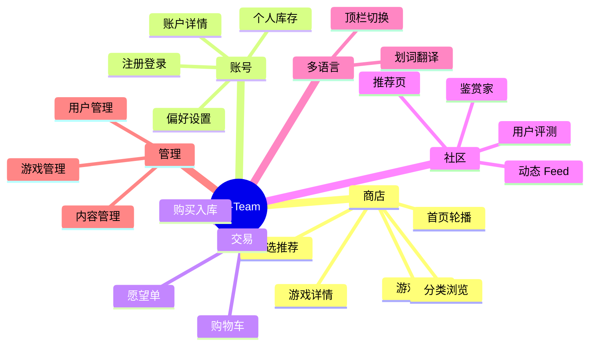

# JX-Team 已实现功能说明

> 面向组员和接手同学的快速参考。  
> 当前项目已经完成主链路统一、后台骨架、多语言基础和大部分演示页面。

---

## 1. 快速上手

| 项目 | 说明 |
|------|------|
| 演示账号 | `Guest / password` |
| 本地启动 | 见 [部署教程.md](部署教程.md) |
| 访问地址 | `http://localhost:3000` |
| 前端路由 | HashRouter |

---

## 2. 功能总览

---

## 3. 商店主链路

### 3.1 首页

- 精选轮播
- 游戏列表
- 分类入口
- 语言切换

### 3.2 游戏详情

- 游戏封面与截图展示
- 购买栏
- 发行日期、开发商、发行商
- 标签与分类跳转
- 用户评测区

### 3.3 分类浏览

支持按以下方式浏览：

- 新品
- 精选
- 标签
- 开发商
- 发行商
- 即将推出
- 特惠
- 手柄支持
- VR

---

## 4. 交易与库存

- 购物车支持加入、移除和结算
- 购买会生成后端 `Purchase` 记录
- 购买后可进入个人库存
- 愿望单支持本地保存与删除

---

## 5. 用户评测

- 支持登录后发表评测
- 支持推荐 / 不推荐
- 支持修改和删除自己的评测
- 只有已购买游戏的用户才能评测
- 详情页会展示评测摘要和评测列表

---

## 6. 社区与推荐

- 探索队列：从未拥有游戏里随机推荐
- 推荐页：按已购游戏的 genre 做同类推荐
- 动态页：展示购买和评测动态
- 鉴赏家页：展示演示用 curator 内容
- 新闻页：展示演示新闻内容

---

## 7. 多语言与翻译

### 7.1 顶栏多语言

顶栏支持：

- 中文
- English
- 日本語
- 한국어

主要覆盖：

- 顶栏和侧边栏文案
- 浏览页标签
- 部分静态页文案
- 游戏类型名称

### 7.2 划词翻译

- 支持选中文字后右键翻译
- 通过 Rails 代理翻译接口
- 未配置 `DEEPSEEK_API_KEY` 时返回占位译文

---

## 8. 后台管理

后台已经有基础骨架，可继续完善的模块包括：

- 游戏管理
- 分类管理
- 标签管理
- 新闻管理
- 鉴赏家推荐管理
- 用户管理
- 购买记录查看
- 评测管理

---

## 9. 静态与演示页面

- 关于
- 帮助
- 统计
- 标签
- 通知
- 安装客户端
- 服务条款
- 隐私政策
- 礼品卡
- 徽章

这些页面主要用于演示和补足站点完整度。

---

## 10. 当前仍需继续完善的点

1. 游戏实体内容的多语言还没完全覆盖。
2. 首页和详情页还有部分布局和内容密度可以继续优化。
3. 购物车、愿望单和设置页仍偏本地存储方案。
4. 后台可以继续补成更完整的可视化管理台。
5. Steam 抓取脚本还需要继续做误命中修正。

---

## 11. 演示流程建议

1. `Guest / password` 登录
2. 首页浏览精选游戏
3. 进入详情页查看截图、购买栏和评测区
4. 加入购物车并购买
5. 进入库存查看已购游戏
6. 撰写一条评测
7. 切换中文 / 日文 / 韩文演示多语言
8. 打开推荐页、动态页、统计页和后台页

---

## 12. 相关文档

| 文件 | 用途 |
|------|------|
| [部署教程.md](部署教程.md) | 本地运行与常见问题 |
| [使用技术栈.md](使用技术栈.md) | 技术栈、架构与使用方式 |
| [当前完成内容文案.md](当前完成内容文案.md) | 当前进度总结 |
| [交接计划与未完成事项.md](交接计划与未完成事项.md) | 后续工作收口 |

